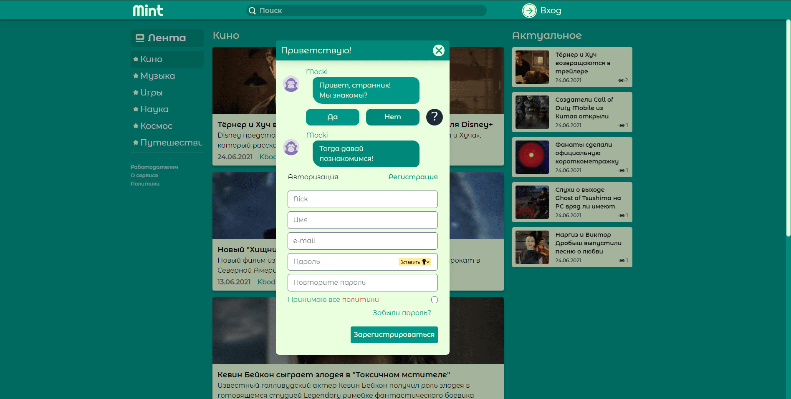

# **mint-news.ru**

Language: [RU](./README.ru.md)

## **Cute news site**

 *Main page. Pop-up authentification / registration*

## **About**

This site was created as a term / thesis that I wrote in my 4th year. This site was a testing ground for new technologies that I was studying, which is why its development was not uniform and lasted half a year. If you add up the development time, it took about 3-4 weeks.

## **Tools used**

### **Design**

To prototype the site, a design was created in the Figma editor.
You can view the layout [here](https://www.figma.com/file/lKx4XSIXOOSCucODXmNRZs/mint-news).

### **Realization**

The following stack was used for development:

- Laravel 8
- Livewire 2.x
- Alpine JS 2.x
- Tailwind css
- SQL + Eloquent

This stack allowed me to build a project relatively quickly without going into the details of reactive Front end development (React, Vue). During the creation of the site I used all sorts of tools to protect against unauthorized access. The site implemented a system of roles, which includes the following roles:

- Guest
- User
- Moderator
- Administrator

The list can be expanded.

### **Current status of the site**

Development of the site has been suspended due to lack of time and desire for development and revision. The site will continue to work and may be finalized later. A full description of the site can be found [here](./static/description.docx) (only RU)
